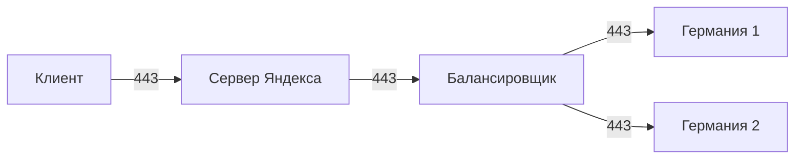
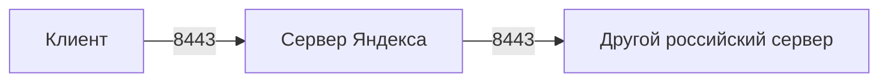

# Схема подключений

## Подключение 1

Клиент подключается к серверу Яндекса, затем трафик идет на балансировщик, после чего направляется в один из двух узлов в Германии. Весь маршрут работает через порт `443`.

## Подключение 2

Клиент подключается к серверу Яндекса, после чего трафик идет на другой российский сервер. Этот маршрут работает через порт `8443`.

